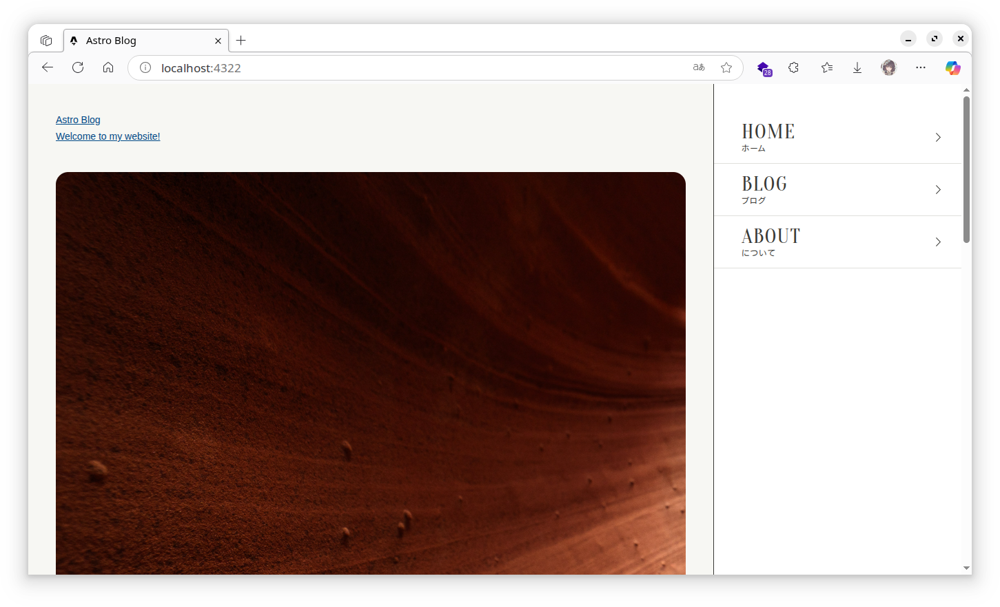
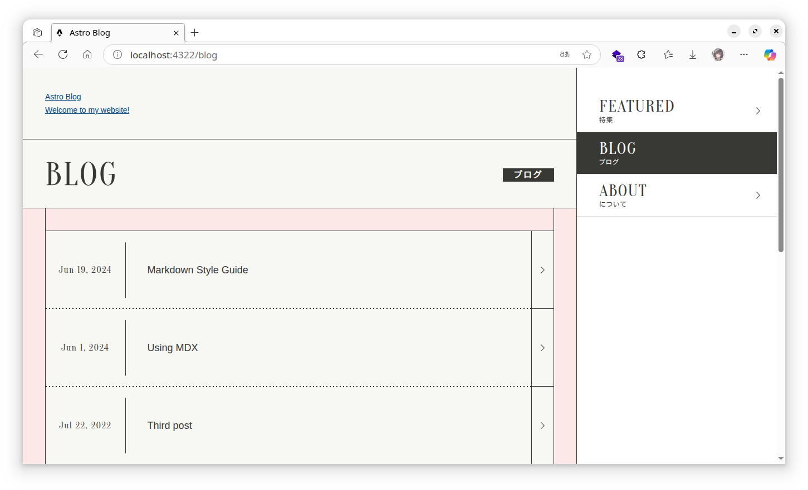
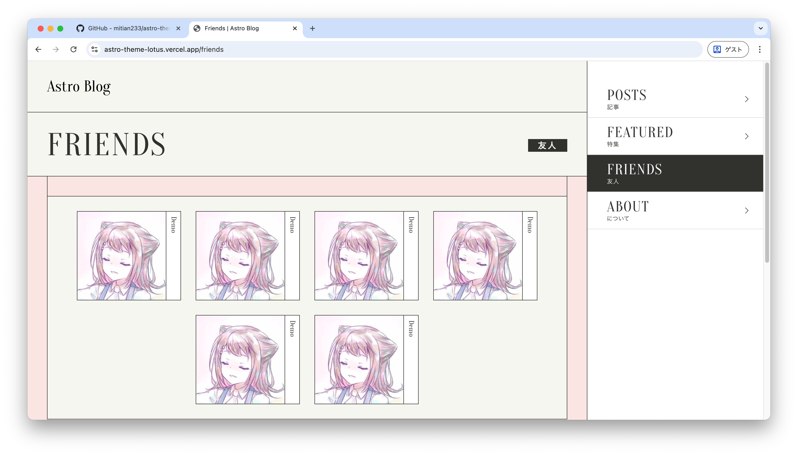
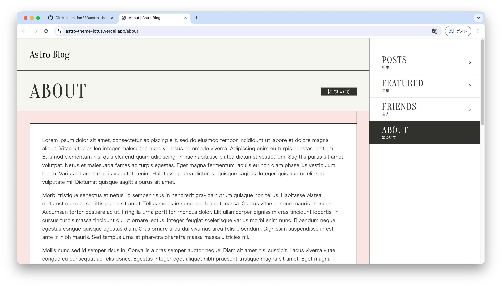

# Astro Theme Lotus

This is a simple, minimal, and fast blog theme inspired by an idol project official site. You can use it to create a personal blog or a simple website. It is built with [Astro](https://astro.build) and uses Markdown(or MDX) for content.

## 🚀 Deploy yours

[](https://vercel.com/new/clone?repository-url=https://github.com/mitian233/astro-theme-lotus)

## 🖼️ Preview






## 🌟 Features

- ✅ Fancybox for images
- ✅ Minimal styling (make it your own!)
- ✅ 100/100 Lighthouse performance
- ✅ SEO-friendly with canonical URLs and OpenGraph data
- ✅ Sitemap support
- ✅ RSS Feed support
- ✅ Markdown & MDX support
- ✅ Comment support
- ⬜ Theme color switcher
- ⬜ Dark mode support
- ⬜ Static files optimization

## 🚀 Project Structure

Inside of your Astro project, you'll see the following folders and files:

```text
├── public/
├── src/
│   ├── components/
│   ├── content/
│   ├── layouts/
│   └── pages/
├── astro.config.mjs
├── README.md
├── package.json
└── tsconfig.json
```

Astro looks for `.astro` or `.md` files in the `src/pages/` directory. Each page is exposed as a route based on its file name.

There's nothing special about `src/components/`, but that's where we like to put any Astro/React/Vue/Svelte/Preact components.

The `src/content/` directory contains "collections" of related Markdown and MDX documents. Use `getCollection()` to retrieve posts from `src/content/blog/`, and type-check your frontmatter using an optional schema. See [Astro's Content Collections docs](https://docs.astro.build/en/guides/content-collections/) to learn more.

Any static assets, like images, can be placed in the `public/` directory.

## 🧞 Commands

All commands are run from the root of the project, from a terminal:

| Command                   | Action                                           |
| :------------------------ | :----------------------------------------------- |
| `npm install`             | Installs dependencies                            |
| `npm run dev`             | Starts local dev server at `localhost:4321`      |
| `npm run build`           | Build your production site to `./dist/`          |
| `npm run preview`         | Preview your build locally, before deploying     |
| `npm run astro ...`       | Run CLI commands like `astro add`, `astro check` |
| `npm run astro -- --help` | Get help using the Astro CLI                     |

## 👀 Want to learn more?

Check out [our documentation](https://docs.astro.build) or jump into our [Discord server](https://astro.build/chat).

## Credit

Some stock images are from [Unsplash](https://unsplash.com/). 

The author assumes no responsibility for any copyright issues that may arise from the content of this website. Any resemblance to existing works is purely coincidental. 
